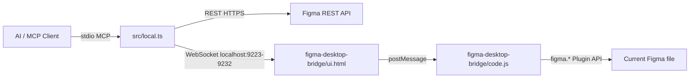
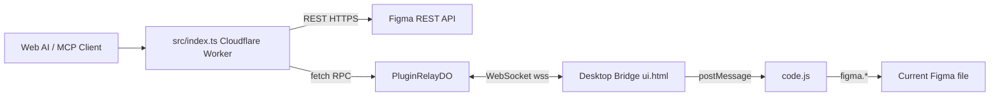

# Figma Console MCP 实现原理

本文从代码实现角度说明本项目如何把 AI 助手、MCP 协议、Figma REST API 和 Figma Desktop Bridge 插件串起来。它不是安装指南，而是给维护者、二次开发者和需要排查链路问题的人看的“系统内部地图”。

## 一句话概览

Figma Console MCP 本质上是一个 MCP Server。AI 客户端通过 MCP 调用工具；工具再按能力选择两条底层通道：

- Figma REST API：适合文件结构、组件、样式、评论、版本等 HTTP 可读取的数据。
- Desktop Bridge：适合变量、写入、截图、插件上下文代码执行、FigJam/Slides 等需要 Figma Plugin API 的能力。

Local Mode 下，Desktop Bridge 是本地 WebSocket 通道：



Cloud Mode 下，写入链路多一层 Cloudflare Durable Object Relay：



## 主要代码入口

| 路径 | 职责 |
| --- | --- |
| `src/local.ts` | Local Mode 入口。创建 `McpServer`，启动本地 HTTP + WebSocket bridge，注册全部工具，最后接入 `StdioServerTransport`。 |
| `src/index.ts` | Cloudflare Worker / Remote Mode 入口。基于 `McpAgent` 提供远程 MCP、OAuth、Cloud Relay、REST API 工具。 |
| `src/core/websocket-server.ts` | 本地 Desktop Bridge WebSocket 服务端。维护已连接 Figma 文件、待处理请求、事件缓冲、健康检查和版本握手。 |
| `src/core/websocket-connector.ts` | `IFigmaConnector` 的本地实现。把工具层的方法调用转换成 bridge command。 |
| `figma-desktop-bridge/ui.html` | Figma 插件 UI。连接本地端口或 cloud relay，并在 UI 与 plugin worker 间转发消息。 |
| `figma-desktop-bridge/code.js` | Figma 插件 worker。真正调用 `figma.*` Plugin API。 |
| `src/core/write-tools.ts` | 写入/修改类 MCP 工具注册，包括 `figma_execute`、变量 CRUD、节点操作、组件集创建等。 |
| `src/core/figma-tools.ts` | REST/Bridge 混合的读取工具注册，例如变量、组件、截图、设计系统数据。 |
| `src/core/tokens-tools.ts` | `figma_export_tokens` / `figma_import_tokens` 的导入导出、diff 和 apply 流程。 |
| `src/core/cloud-websocket-relay.ts` | Cloud Mode 的 Desktop Bridge relay Durable Object。 |
| `src/core/port-discovery.ts` | 本地多实例端口发现、端口广告文件、心跳、僵尸进程清理。 |
| `src/core/identity.ts` | 给所有工具响应和错误打上 `_mcp: "figma-console-mcp"` / `[figma-console-mcp]`，避免多个 Figma MCP 混淆。 |

## Local Mode 启动流程

Local Mode 的入口在 `src/local.ts` 的 `LocalFigmaConsoleMCP.start()`。

启动时按以下顺序执行：

1. 复制 Desktop Bridge 插件文件到稳定目录 `~/.figma-console-mcp/plugin/`。
2. 读取 `FIGMA_WS_HOST` / `FIGMA_WS_PORT`，默认使用 `localhost:9223`。
3. 清理过期端口文件和可能占用 9223-9232 的僵尸进程。
4. 依次尝试绑定端口范围 `9223-9232`，创建 `FigmaWebSocketServer`。
5. 写入 `/tmp/figma-console-mcp-{port}.json` 端口广告文件，供插件发现。
6. 启动 heartbeat，定期刷新端口文件的 `lastSeen`。
7. 注册 WebSocket 事件，用于连接日志、缓存失效、文档变化监听。
8. 调用 `registerTools()` 注册 MCP 工具。
9. 使用 `StdioServerTransport` 把 MCP server 接入本地 AI 客户端。

关键点是：MCP stdio 和 Desktop Bridge WebSocket 是两条不同通道。AI 客户端通过 stdio 进来，Figma 插件通过 WebSocket 主动连进来。

## Desktop Bridge 通信协议

Desktop Bridge 的数据流是：

```text
MCP Tool Handler
  -> WebSocketConnector method
  -> FigmaWebSocketServer.sendCommand(method, params)
  -> ui.html WebSocket message
  -> ui.html parent.postMessage(...)
  -> code.js figma.ui.onmessage
  -> Figma Plugin API
  -> code.js figma.ui.postMessage(result)
  -> ui.html WebSocket response
  -> FigmaWebSocketServer resolves pending request
```

WebSocket 命令一般是 JSON：

```json
{
  "id": "req_1_1780000000000",
  "method": "EXECUTE_CODE",
  "params": {
    "code": "const rect = figma.createRectangle(); return { id: rect.id };",
    "timeout": 5000
  }
}
```

插件返回：

```json
{
  "id": "req_1_1780000000000",
  "result": {
    "success": true,
    "result": {
      "id": "12:34"
    }
  }
}
```

`FigmaWebSocketServer` 用 `pendingRequests` 保存 request id、目标 fileKey、超时器和 resolver。收到响应时不会只看 id，还会验证响应来自目标文件对应的 socket，避免多文件/多插件连接时串线。

## 多文件与活动文件选择

Desktop Bridge 插件连接后会先发送 `FILE_INFO`。服务端用它把“未识别 socket”提升为某个 Figma 文件的 `ClientConnection`。

每个连接保存：

- `fileInfo`：文件名、fileKey、当前 page、editorType、插件版本。
- `selection`：当前选择。
- `documentChanges`：文档变化 ring buffer。
- `metadataChanges`：description / annotations 等 REST 版本 diff 不可见字段的变化。
- `consoleLogs`：插件上下文日志。
- `lastActivity` / `lastPongAt`：活跃度和心跳状态。

当插件发来 `SELECTION_CHANGE` 或 `PAGE_CHANGE` 时，服务端会把该文件设为 active file。没有显式 `fileKey` 的工具调用通常落到 active file 上。

## 端口发现与多实例

项目支持多个 MCP server 同时运行，例如 Claude Desktop Chat、Claude Code、Cursor 各启动一个实例。

实现方式在 `src/core/port-discovery.ts`：

- 端口范围固定为 `9223-9232`。
- 每个成功绑定的 server 写一个 `/tmp/figma-console-mcp-{port}.json`。
- 文件内包含 `port`、`pid`、`host`、`startedAt`、`lastSeen`。
- server 每 30 秒刷新一次 `lastSeen`。
- 插件启动时扫描端口范围并连接所有可用 server。
- server 启动前会清理死 PID、心跳过期、无端口文件但仍占端口的旧进程。

这解决了常见的 `EADDRINUSE`：不要求用户手动杀进程，优先找下一个端口；端口全满时才尝试驱逐最旧实例。

## 工具注册模型

所有 MCP 工具都挂在一个 `McpServer` 实例上。`src/local.ts` 中的 `registerTools()` 负责把不同模块的工具组合起来：

- 本地内置工具：console logs、截图、状态、连接诊断等。
- `registerWriteTools(...)`：所有需要 Desktop Bridge 写入的工具。
- `registerTokensTools(...)`：设计 token 导入导出工具。
- `registerFigmaAPITools(...)`：Figma REST API 和 Bridge 混合读取工具。
- `registerDesignCodeTools(...)`：设计代码一致性和文档工具。
- `registerCommentTools(...)`：评论 API。
- `registerVersionTools(...)`：版本历史、diff、changelog。
- `registerDesignSystemTools(...)`：完整设计系统 kit。
- `registerLibraryTools(...)` / `registerLibraryVariableTools(...)`：共享库组件和变量。
- `registerAccessibilityTools(...)`：代码侧可访问性扫描。
- `registerAnnotationTools(...)`、`registerDeepComponentTools(...)`、`registerFigJamTools(...)`、`registerSlidesTools(...)`。
- MCP Apps：当 `ENABLE_MCP_APPS=true` 时注册 Token Browser 和 Design System Dashboard。

工具模块通常遵循这个模式：

```ts
registerXxxTools(server, () => getFigmaAPI(), () => getCurrentFileUrl(), ...);
```

或：

```ts
registerWriteTools(server, () => getDesktopConnector());
```

这样工具实现不用关心当前是 Local WebSocket 还是 Cloud Relay，只依赖抽象 connector。

## Connector 抽象

写入类工具不会直接操作 WebSocket，而是调用 `IFigmaConnector`。

Local Mode 中：

```text
getDesktopConnector()
  -> new WebSocketConnector(wsServer)
  -> connector.method(...)
  -> wsServer.sendCommand(...)
```

Cloud Mode 中：

```text
getDesktopConnector()
  -> new CloudWebSocketConnector(...)
  -> connector.method(...)
  -> fetch /relay/command
  -> PluginRelayDO
  -> plugin WebSocket
```

这个抽象让 `src/core/write-tools.ts`、`src/core/tokens-tools.ts` 等模块可以在本地和云端复用同一套 MCP 工具定义。

## REST API 与 Bridge 的职责边界

REST API 更适合稳定、服务器可访问的文件数据：

- `GET /v1/files/:key`
- `GET /v1/files/:key/nodes`
- `GET /v1/files/:key/styles`
- `GET /v1/images/:key`
- 评论、版本、组件库等 API

Desktop Bridge 更适合插件运行时能力：

- 当前文件变量读取和变量 CRUD。
- `figma_execute` 执行任意 Plugin API 代码。
- `figma.create*`、节点移动/变形/填充/描边。
- `exportAsync` 截图，能反映当前本地文件状态。
- component descriptions、annotations、metadata change 等 REST 不完整或拿不到的数据。
- FigJam / Slides 的插件 API 能力。

很多工具是 bridge-first：如果 Desktop Bridge 可用，优先使用插件 API；不可用时才尝试 REST fallback。这让非 Enterprise 用户也能读取变量，并避免 REST 数据滞后或缺字段。

## 写入工具实现

写入工具集中在 `src/core/write-tools.ts`。

最底层的万能入口是 `figma_execute`。它接受 JavaScript 字符串，在插件上下文执行，能直接访问 `figma` 全局对象：

```ts
const connector = await getDesktopConnector();
const result = await connector.executeCodeViaUI(code, Math.min(timeout, 30000));
```

更高层工具则把常见操作封装成结构化参数，例如：

- `figma_create_variable`
- `figma_update_variable`
- `figma_batch_create_variables`
- `figma_set_fills`
- `figma_resize_node`
- `figma_set_instance_properties`
- `figma_create_component_set`

这些工具的好处是：

- 输入由 Zod schema 约束，AI 不容易传错。
- 工具描述里写入具体使用约束，例如 instance 应优先改 component properties。
- 批量工具减少 roundtrip，变量批量创建/更新比逐条调用快很多。
- 超时可按任务复杂度调整，例如组件集创建按 variant 数量放大超时。

## 截图链路

截图工具有两类常见来源：

- Desktop Bridge `exportAsync`：当前运行时状态，适合验证刚刚写入的视觉结果。
- REST image endpoint：适合远程渲染或 PDF 等 Bridge 不支持的格式。

Local Mode 的 `figma_take_screenshot` 是 bridge-first。非 PDF 且插件已连接时，会调用 `connector.captureScreenshot(...)`；只有 bridge 不可用或格式不适合时才走 REST fallback。

这对 AI 视觉验证很重要：刚写入 Figma 后，REST API 可能有同步延迟，而插件 `exportAsync` 看到的是当前打开文件的实时状态。

## Token Sync 实现

Token Sync 的核心在 `src/core/tokens-tools.ts` 和 `src/core/tokens/`。

### Export

`figma_export_tokens` 的流程：

1. 读取 `tokens.config.json`，或使用调用参数。
2. 通过 Desktop Bridge 读取当前文件变量。
3. 归一化变量和 collection 结构。
4. 转换为内部 `TokenDocument`。
5. 根据目标格式输出 DTCG、CSS vars、Tailwind、SCSS、TS module、JSON、Style Dictionary、Tokens Studio 等文件。
6. 如果有 `outputPath` 或 config，则写入本地文件；否则 inline 返回内容。

内部以 DTCG / `TokenDocument` 作为 pivot，避免每个格式直接耦合 Figma 原始变量结构。

### Import

`figma_import_tokens` 的流程：

1. 读取输入 token 文件或 inline payload。
2. parse 成一个或多个 `TokenDocument`。
3. 合并文档。
4. 读取当前 Figma 变量状态。
5. 计算 diff plan：`toCreate`、`toUpdate`、`toRename`、`toDelete`、`unchanged`。
6. dry-run 时只返回计划。
7. apply 时按顺序执行：
   - create：先创建 collection 和变量，alias 延后到第二阶段。
   - update / rename：更新值、描述、scopes、codeSyntax，rename 通过变量 ID 匹配。
   - delete：只在 `strategy: "replace"` 下执行。

删除被严格限制在 replace 策略下，是为了让默认 merge 模式保持非破坏性。

## Cloud Relay 实现

Cloud Mode 的写入能力由 `src/core/cloud-websocket-relay.ts` 提供。

`PluginRelayDO` 是一个 Durable Object，提供三个路由：

- `/ws/connect`：Desktop Bridge 插件通过 WebSocket 连接进来。
- `/relay/command`：Cloud MCP server 通过 fetch RPC 发命令。
- `/relay/status`：查询插件连接和文件信息。

命令流程：

1. AI 调用云端 MCP 工具。
2. 工具通过 `CloudWebSocketConnector` 请求 `/relay/command`。
3. Durable Object 生成 relay request id，发给插件 WebSocket。
4. 插件执行 Figma Plugin API。
5. 插件把同 id 的结果发回 Durable Object。
6. Durable Object resolve 正在等待的 fetch response。

Durable Object 使用 hibernation-safe 模式：WebSocket 通过 `ctx.getWebSockets('plugin')` 获取，fileInfo 存储在 DO storage，pending request 只保存在内存中，因为活跃 fetch 会保持 DO 唤醒。

## 缓存与失效

Local server 中有 `variablesCache`，主要避免大型变量集合反复塞满 MCP 上下文。

缓存失效时机包括：

- Desktop Bridge 文件断开连接。
- 插件发送 `DOCUMENT_CHANGE`，且包含 style 或 node changes。
- 变量写入操作成功后主动清空。
- Design System Manifest cache 也会随 fileKey 被同步失效。

缓存按 fileKey 管理，尽量只清理受影响文件，避免多个 Figma 文件同时连接时互相影响。

## 诊断与错误恢复

`getDesktopConnector()` 在没有插件连接时不会静默失败，而是抛出带结构化 `connectionError` 的错误。错误区分两层：

- Layer 1：MCP server / WebSocket server 本身不可用。
- Layer 2：Desktop Bridge 插件未连接、命令超时或 bridge 错误。

`figma_diagnose` 则汇总：

- server version。
- bundled plugin version。
- 当前插件连接状态。
- fileName / fileKey / currentPage / editorType。
- 实际绑定端口和 fallback 信息。
- token 是否存在。
- plugin 是否需要重新导入。

这让 AI 或用户能按结构化信息恢复，而不是解析英文 hint。

## 安全边界

项目有几层重要安全约束：

- WebSocket `verifyClient` 只允许空 origin、`null`、`https://www.figma.com`、`https://figma.com`，防止 Cross-Site WebSocket Hijacking。
- 端口清理使用 `execFile` / `execFileSync`，避免把不可信端口值拼进 shell。
- MCP 响应统一加 `_mcp` 标识，错误统一加 `[figma-console-mcp]` 前缀，避免多 MCP 环境下误归因。
- `figma_execute` 明确标注可修改文档，默认超时也被限制。
- Token import 默认 dry-run / merge 思路，破坏性删除必须显式 replace。

## 插件版本握手

Figma 会缓存 Development plugin 文件，所以 server 更新不一定代表用户正在运行新插件。

`src/core/websocket-server.ts` 会从打包的 `figma-desktop-bridge/code.js` 中解析 `PLUGIN_VERSION`，作为 bundled plugin version。插件连接时通过 `FILE_INFO` 上报自身版本。服务端比较两者：

- 相同：插件文件与当前 server 匹配。
- 不同或缺失：标记 `pluginUpdateAvailable`，提示用户重新导入 manifest。

注意这里比较的是插件文件版本，不是 package version。这样 server-only 发布不会错误提示用户重导插件。

## MCP Apps

当 `ENABLE_MCP_APPS=true`，Local Mode 会注册 MCP Apps：

- Token Browser。
- Design System Dashboard。

Apps 使用同一套数据获取策略：先查缓存，再尝试 Desktop Bridge，最后尝试 REST fallback。它们只在 Local Mode 可用，因为当前 app server 需要 Node.js 文件系统能力来服务 UI。

## 新增工具的一般步骤

新增工具时建议按这个顺序判断放在哪里：

1. 只读且 REST API 能稳定提供：放到 `src/core/figma-tools.ts` 或对应专门模块。
2. 需要 Figma Plugin API 或写文件内状态：放到 `src/core/write-tools.ts` 或新建 bridge-first 模块，依赖 `getDesktopConnector()`。
3. 需要同时支持 Local 和 Cloud 写入：优先通过 `IFigmaConnector` 增加方法，不要在工具里直接写 WebSocket 或 Durable Object 细节。
4. 需要大量批量写入：设计 batch command，避免 N 次 MCP roundtrip。
5. schema 必须用严格 Zod 类型；不要用 `z.any()`，避免模型/客户端 schema 兼容问题。
6. 返回 JSON 时保持 `_mcp` 标识可被 `wrapServerForIdentity` 自动加上。

## 排查链路时的推荐顺序

当某个工具不可用时，按下面顺序定位：

1. `figma_diagnose`：确认 server、token、插件、版本、端口。
2. `/tmp/figma-console-mcp-{port}.json`：确认端口广告和 `lastSeen`。
3. Figma Desktop Bridge UI：确认 READY、server count、是否提示 re-import。
4. `figma_get_status` / `figma_get_console_logs`：确认 WebSocket 和插件日志。
5. 工具自身返回的 `connectionError`：判断是 server 层、bridge 层还是命令超时。
6. 如果是变量/设计系统数据异常，检查缓存是否被旧连接污染，必要时重新打开插件触发刷新。

## 设计取舍

这个项目的核心取舍是“Bridge-first，但 REST 不丢”：

- REST API 是官方、稳定、适合云端的读取通道。
- Desktop Bridge 能拿到 REST 拿不到或不完整的数据，也能写入当前文件。
- Connector 抽象让 Local 和 Cloud 复用工具逻辑。
- 端口广告、heartbeat 和僵尸清理让本地多实例体验更稳。
- Identity tagging 和诊断工具让多 MCP 环境可解释。
- Token pipeline 把 Figma 变量转换成代码侧 token 文档，再通过 diff apply 回写，避免一次性覆盖式同步。

最终效果是：AI 助手看到的是一组结构化 MCP 工具；项目内部则根据工具性质，在 REST、Local Desktop Bridge、Cloud Relay 之间选择最可靠的执行路径。
